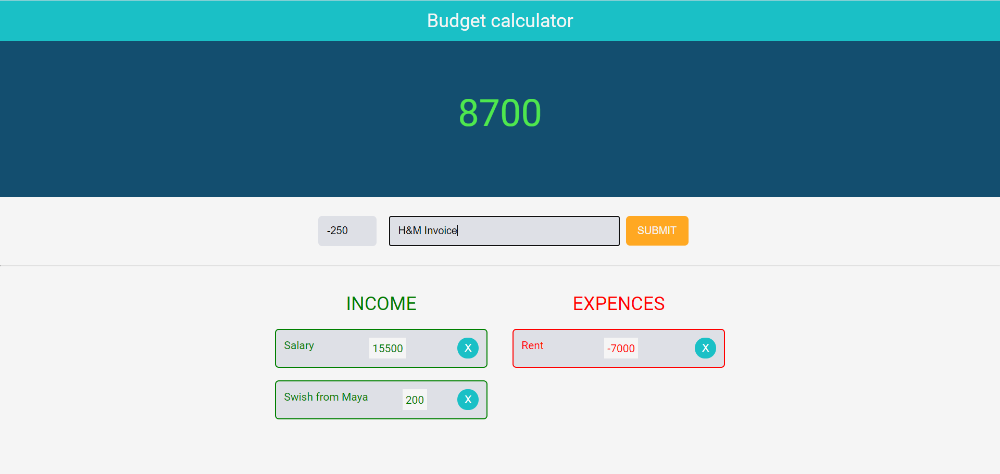

# Budget-planner-app

A budget calculator application where the user is able to follow personal expenses build using Angular with TypeScript.The application is built as an exercise for cross-component communication using event and property binding. It will be updated with Angular Services in the future.

## Live demo availabe [here](https://budget-planner-angular.netlify.app/)

## Features available:

- **the user can add and remove expenses or income**
- **positive or negative total amount is displayed at all times**
